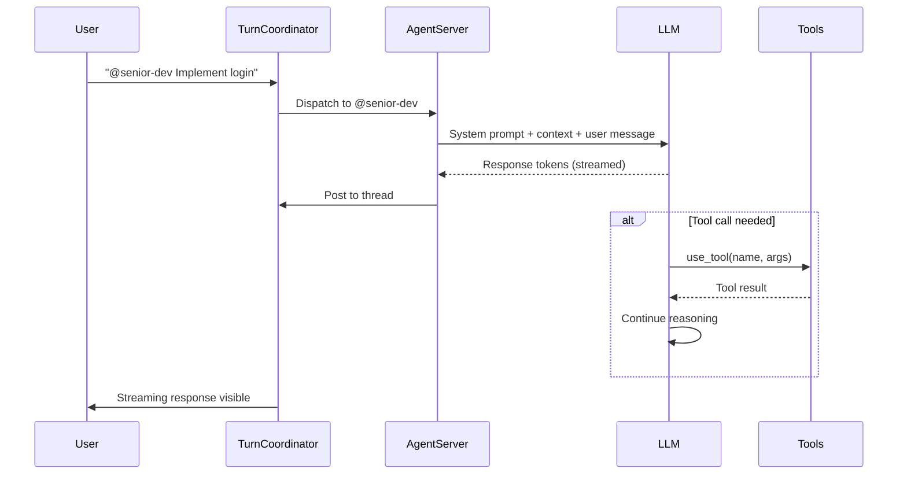

# Agent Reference

Cortana comes with a set of pre-configured AI agents, each with specialized roles and capabilities. This guide covers when to use each agent and how to get the best results.

## Default Agents

### @ceo

**Role:** Strategy, planning, and task coordination

**When to use:**
- Breaking down a vision into actionable tasks
- Strategic decisions and prioritization
- Coordinating work across multiple agents
- Creating the initial project structure

**Capabilities:**
- `create_task` — Propose new work items
- `read_board` — View all tasks and status
- `search_memory` — Recall past decisions
- `list_agents` — Discover available teammates
- `spawn_sub_conversation` — Create focused threads for deep-dives

**Example prompts:**
```
@ceo We need to build a user authentication system. What are the steps?

@ceo Our landing page isn't converting. What should we focus on first?

@ceo Create a roadmap for our Q2 release with these features: [list]
```

**Limitations:**
- Cannot access code files directly
- Cannot execute shell commands
- Cannot use MCP integrations (by default)
- Tasks require human approval before execution

---

### @cto

**Role:** Architecture, technical decisions, and code quality

**When to use:**
- Designing system architecture
- Making technology choices
- Reviewing technical proposals
- Debugging complex issues

**Capabilities:**
- `read_board` — Query task status
- `search_memory` — Recall past technical decisions
- `list_agents` — Discover available teammates
- `spawn_sub_conversation` — Focused architectural deep-dives

**Example prompts:**
```
@cto Should we use JWT or session-based authentication for our app?

@cto Review this architecture: [paste diagram]. Any concerns?

@cto Our API response times are slow. How do we investigate?
```

**Limitations:**
- Cannot modify code directly
- Cannot deploy or run infrastructure commands
- Cannot approve tasks (human only)

---

### @senior-dev

**Role:** Senior-level code implementation and problem-solving

**When to use:**
- Implementing features
- Refactoring complex code
- Solving difficult technical problems
- Mentoring junior developers (via conversation)

**Capabilities:**
- `read_file` — Read code files (scoped to worktree)
- `write_file` — Create/modify files
- `grep` — Search codebase
- `bash` — Run shell commands (Docker-isolated)
- `save_artifact` — Produce code deliverables
- `search_memory` — Find relevant context
- `web_search` — Research documentation
- `fetch_url` — Read API docs and tutorials

**Example prompts:**
```
@senior-dev Implement a login endpoint with JWT tokens and refresh token rotation.

@senior-dev Refactor this module to follow the repository pattern: [paste code]

@senior-dev The production logs show [error]. Diagnose and fix.
```

**Limitations:**
- Scoped to worktree directory (cannot access arbitrary paths)
- Shell commands run in Docker container (no host access)
- Large refactors may require task breakdown and approval

---

### @frontend-dev

**Role:** Frontend development, UI/UX implementation

**When to use:**
- Building React, Vue, or Svelte components
- Implementing responsive designs
- Fixing CSS/layout issues
- Accessibility improvements

**Capabilities:**
- `read_file` — Read frontend code
- `write_file` — Create components, styles, tests
- `grep` — Search for component usage
- `bash` — Run build tools (npm, vite, etc.)
- `save_artifact` — Produce frontend deliverables
- `web_search` — Research UI patterns
- `fetch_url` — Read design specs or docs

**Example prompts:**
```
@frontend-dev Build a responsive navbar with mobile hamburger menu.

@frontend-dev Convert this Figma design to Tailwind CSS: [paste specs]

@frontend-dev Our Lighthouse accessibility score is 72. How do we get to 90+?
```

**Limitations:**
- Cannot access backend services directly
- Cannot modify database schemas
- Build commands run in isolated environment

---

### @devops-automator

**Role:** Infrastructure, CI/CD, and deployment automation

**When to use:**
- Setting up CI/CD pipelines
- Writing Docker files and Kubernetes manifests
- Configuring monitoring and alerting
- Automating deployments

**Capabilities:**
- `read_file` — Read infra configs
- `write_file` — Create Dockerfile, docker-compose.yml, K8s manifests
- `grep` — Search infra configs
- `bash` — Run infra commands (terraform, kubectl, etc.)
- `save_artifact` — Produce deployment configs
- `web_search` — Research best practices
- `fetch_url` — Read cloud provider docs

**Example prompts:**
```
@devops-automator Create a GitHub Actions workflow that deploys to production on main branch push.

@devops-automator Set up monitoring for our Elixir app with Prometheus and Grafana.

@devops-automator Our Docker image is 800MB. Optimize it to under 200MB.
```

**Limitations:**
- Cannot access production environments directly
- Deployment requires human approval
- Cloud credentials stored encrypted, not in code

---

### @code-reviewer

**Role:** Code review, quality checks, and best practices

**When to use:**
- Reviewing pull requests
- Checking code quality before merge
- Identifying security vulnerabilities
- Ensuring consistent style

**Capabilities:**
- `read_file` — Read code for review
- `grep` — Search for patterns (e.g., hardcoded secrets)
- `search_memory` — Recall coding standards
- `save_artifact` — Produce review reports

**Example prompts:**
```
@code-reviewer Review this PR for security issues: [paste diff]

@code-reviewer Are there any race conditions in this code? [paste code]

@code-reviewer Check this module for Elixir best practices: [paste code]
```

**Limitations:**
- Cannot modify code (read-only)
- Cannot approve or merge PRs
- Review recommendations require human judgment

---

## Agent Comparison Table

| Agent | Code Access | Task Creation | MCP Tools | Best For |
|-------|-------------|---------------|-----------|----------|
| @ceo | ❌ | ✅ | ❌ | Strategy, planning |
| @cto | ❌ | ✅ | ❌ | Architecture decisions |
| @senior-dev | ✅ Full | ✅ | ✅ | Feature implementation |
| @frontend-dev | ✅ Frontend | ✅ | ✅ | UI/UX development |
| @devops-automator | ✅ Infra | ✅ | ✅ | CI/CD, deployments |
| @code-reviewer | ✅ Read-only | ❌ | ❌ | Code review |

---

## Custom Agents

You can create custom agents in **Admin → Agents**:

1. Click **"New Agent"**
2. Configure:
   - **Name**: @marketing, @legal, @data-scientist, etc.
   - **Instructions**: Role-specific system prompt
   - **Model**: Choose per-agent (Haiku for cheap, Opus for complex)
   - **Tools**: Select allowed tools
   - **MCP Servers**: Configure external integrations
3. Click **"Save"**

### Example: Custom @researcher Agent

```yaml
name: @researcher
instructions: |
  You are a market research specialist. Your job is to:
  1. Gather information using web_search and fetch_url
  2. Synthesize findings into clear reports
  3. Propose follow-up tasks based on insights
tools:
  - web_search
  - fetch_url
  - save_artifact
  - create_task
allowed_mcp_servers:
  - LinkedIn  # For professional research
```

---

## Agent Dispatch Flow

When you @mention an agent, here's what happens:



### Turn Coordinator

The **TurnCoordinator** manages sequential agent dispatch to prevent chaos:

1. **Batch window** (3 seconds) — Collects rapid-fire @mentions
2. **Sequential dispatch** — Agents respond one at a time
3. **Heartbeat** — Extends timeout while streaming
4. **Chain depth** — Detects and pauses runaway agent-to-agent chains

---

## Token Budgets

Each agent has token limits to control costs:

| Agent Type | Token Budget | Cost Control |
|------------|--------------|--------------|
| Permanent agents (CEO, CTO) | 50,000 tokens/invocation | Force text response if exceeded |
| Workers (basic) | 100,000 tokens/task | Terminate loop at limit |
| Workers (code) | 500,000 tokens/task | Higher limit for complex refactors |

### Cost Estimates (via OpenRouter)

| Model | Input/MTok | Output/MTok | Recommended Use |
|-------|------------|-------------|-----------------|
| claude-haiku-4-5 | $0.80 | $4.00 | Simple tasks, research |
| claude-sonnet-4-6 | $3.00 | $15.00 | General development |
| claude-opus-4-6 | $15.00 | $75.00 | Complex architecture, debugging |

**Pro tip:** Configure @ceo to use Haiku (cheap summaries) and @senior-dev to use Sonnet (balanced cost/performance).

---

## Best Practices

### 1. Assign the Right Agent
```
❌ "@ceo Write the login function"
✅ "@senior-dev Write the login function"

❌ "@developer Should we use PostgreSQL or MySQL?"
✅ "@cto Should we use PostgreSQL or MySQL?"
```

### 2. Provide Context
```
❌ "@senior-dev Fix the bug"
✅ "@senior-dev The login endpoint returns 500 when password is null. 
   Logs show: [paste]. Fix and add test."
```

### 3. Break Down Large Requests
```
❌ "@senior-dev Build the entire authentication system"
✅ "@ceo Break down the auth system into tasks"
   → CEO creates tasks for schema, endpoints, tests
   → Approve tasks, workers execute
```

### 4. Use Threads for Related Work
```
# Good: All auth discussion in one thread
Thread: "Auth System Implementation"
├── CEO creates tasks
├── CTO reviews architecture
├── Developer implements
└── Reviewer checks quality

# Bad: Scattered across threads
Thread 1: "Auth schema" (CEO)
Thread 2: "Auth code" (Developer)  # Context lost!
```

---

## Troubleshooting

### Agent not responding?

1. Check agent is **active** (Admin → Agents)
2. Verify agent is **member of channel**
3. Ensure **LLM credits** available
4. Check **token budget** not exhausted

### Agent makes mistakes?

1. **Refine instructions** — Add specific constraints in agent config
2. **Add tools** — Ensure agent has required capabilities
3. **Break down tasks** — Large requests fail more often
4. **Human review** — Always approve before deployment

### Cost too high?

1. **Route to cheaper models** — Haiku for simple tasks
2. **Set token budgets** — Limit per-agent spending
3. **Review tool usage** — MCP calls can be expensive
4. **Use search_memory** — Avoid re-explaining context

---

**Related:**
- [Quick Start Guide](/docs/quickstart) — Get started in 5 minutes
- [Core Concepts](/docs/concepts) — Understand the system
- [Workflows](/docs/workflows) — Common use case patterns
- [Architecture Overview](/docs/architecture) — Technical internals
