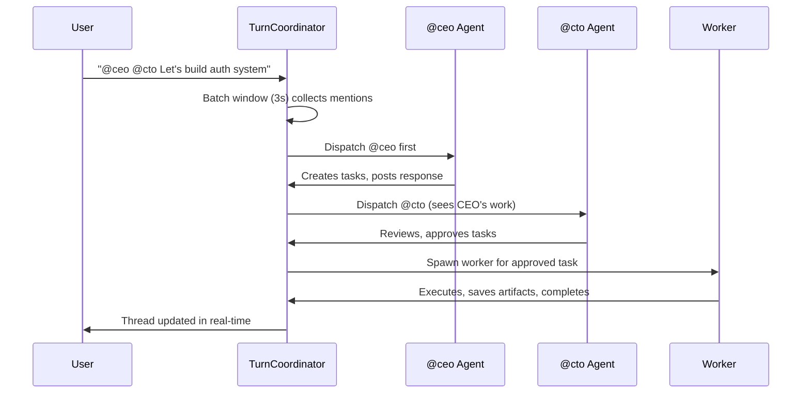

# Architecture Overview

This document provides a technical overview of Cortana's internals. Intended for developers who want to understand how the system works or contribute to the codebase.

**Source code:** [`lurielle-studio/cortana`](https://github.com/lurielle-studio/cortana)

---

## System Overview

Cortana is a multi-agent AI coordination system built with **Elixir**, **Phoenix**, and **OTP**. It orchestrates specialized AI agents that collaborate in shared conversation threads with human oversight.

### High-Level Architecture

```
┌─────────────────────────────────────────────────────────────────┐
│                     Phoenix LiveView UI                          │
│  (Thread conversations, task board, agent admin, settings)       │
└─────────────────────┬───────────────────────────────────────────┘
                      │ Phoenix Channels / PubSub
                      ▼
┌─────────────────────────────────────────────────────────────────┐
│                  TurnCoordinator (per-thread)                    │
│  • Manages agent dispatch sequencing                             │
│  • Batch window collection (3s)                                  │
│  • Token streaming orchestration                                 │
│  • Chain depth monitoring                                        │
│  • Heartbeat timeout management                                  │
└─────────────────────┬───────────────────────────────────────────┘
                      │
         ┌────────────┼────────────┐
         ▼            ▼            ▼
┌─────────────┐ ┌───────────┐ ┌──────────────┐
│ AgentServer │ │ Worker    │ │ Classifier   │
│ GenServer   │ │ GenServer │ │ (intent      │
│ (permanent) │ │(ephemeral)│ │  routing)    │
└──────┬──────┘ └─────┬─────┘ └──────────────┘
       │              │
       │              └───► AgenticLoop (multi-turn tool use)
       │
       ▼
┌─────────────────┐
│ ToolExecutor    │
│ • create_task   │
│ • read_board    │
│ • search_memory │
│ • MCP tools     │
│ • Code tools    │
└────────┬────────┘
         │
         ▼
┌─────────────────────────────────────────────────────────────────┐
│                    Context Modules                               │
│  Tasks, Messages, Threads, Observations, Agents, MCP,           │
│  Notifications, Storage, Webhooks, Finances, Learning            │
└─────────────────────────────────────────────────────────────────┘
```

---

## Technical Stack

| Layer | Technology | Purpose |
|-------|------------|---------|
| **Backend** | Elixir 1.15+, OTP | Concurrent agent processes |
| **Web Framework** | Phoenix 1.8 | HTTP, WebSockets, LiveView |
| **Database** | PostgreSQL + Ecto | Persistent storage |
| **Real-Time** | Phoenix Channels + PubSub | Live updates |
| **Frontend** | Phoenix LiveView + HEEx + Tailwind | Zero-JS reactive UI |
| **Job Queue** | Oban | Background jobs |
| **Caching** | ETS + Cachex | In-memory state |
| **Storage** | Local disk (S3-ready) | Artifacts and uploads |

---

## Thread Coordination Model

The **TurnCoordinator** is Cortana's patented dispatch pattern that manages multi-agent conversations.

### State Machine

```
┌─────────────────────────────────────────────────────────────────┐
│                   TurnCoordinator State Machine                  │
│                                                                  │
│   IDLE ──► COLLECTING ──► DISPATCHING ──► STREAMING ──► IDLE   │
│              (3s batch)    (agent 1)      (tokens)               │
│                  │              │              │                 │
│                  │              │              └─► Agent 1 done  │
│                  │              │                                │
│                  │              └─► Heartbeat extends timeout    │
│                  │                                                │
│                  └─► Collects rapid messages                    │
│                      (@ceo @cto in 2 sec window)                 │
└─────────────────────────────────────────────────────────────────┘
```

### Dispatch Flow



### Key Features

1. **Sequential Dispatch** — Agents respond one at a time, seeing prior work
2. **Batch Window** — 3-second collection for rapid @mentions
3. **Heartbeat Timeout** — Extends timeout while streaming tokens
4. **Chain Depth** — Detects runaway agent-to-agent chains (>6 triggers pause)

---

## Agent System

### Permanent Agents vs. Workers

| Permanent Agents | Workers |
|------------------|---------|
| Long-running GenServers | Ephemeral, per-task |
| Pre-configured roles (CEO, CTO) | Spawned to execute tasks |
| Limited tool permissions | Full code execution |
| Respond to @mentions | Auto-spawned on approval |

### Agent GenServer Architecture

```elixir
defmodule Cortana.AgentServer do
  use GenServer

  # State
  defstruct [
    :name,              # @ceo, @cto, etc.
    :instructions,      # System prompt
    :model,             # LLM model (Haiku, Sonnet, Opus)
    :allowed_tools,     # Tool permissions
    :token_budget,      # Max tokens per invocation
    :current_thread,    # Active thread context
    :cursor,            # Memory cursor position
    :agentic_loop       # Multi-turn tool use state
  ]

  # Callbacks
  def init(agent_config)
  def handle_cast(:dispatch, state)
  def handle_info(:stream_token, state)
  def terminate(reason, state)
end
```

### Agentic Loop

Workers use a multi-turn reasoning loop for complex tasks:

```
Iteration 0: User task + system prompt
    ↓ LLM reasoning
Iteration 1: Tool call (read_file "login.ex")
    ↓ Tool execution
Iteration 2: LLM sees result, continues reasoning
    ↓ Tool call (write_file ...)
    ...
Iteration N: Task complete or budget exceeded
```

**Budget tracking:** Each iteration accumulates tokens. When approaching max, tools are removed from the request to force text completion.

---

## Memory System

### Three-Level Hierarchy

```
┌─────────────────────────────────────────────────────────────────┐
│                         MEMORY HIERARCHY                         │
│                                                                  │
│  ORG LEVEL (Persistent)                                          │
│  Company-wide institutional knowledge                            │
│  • Major decisions, product strategy, key learnings              │
└─────────────────────────────────────────────────────────────────┘
                 ▲ (Thread archived → promote)
        ┌────────┴─────────┐
┌─────────────────────────────────────────────────────────────────┐
│  CONTEXT LEVEL (Persistent)                                      │
│  Project-level knowledge (archived threads)                      │
│  • Completed feature specs, architecture, resolved bugs          │
└─────────────────────────────────────────────────────────────────┘
                 ▲ (Thread activity)
        ┌────────┴─────────┐
┌─────────────────────────────────────────────────────────────────┐
│  THREAD LEVEL (Active)                                           │
│  Live conversation observations                                  │
│  • Current progress, blockers, agent actions                     │
└─────────────────────────────────────────────────────────────────┘
```

### Observations

AI-powered compression of conversations into searchable summaries:

```elixir
defstruct [
  :id,
  :level,             # :thread, :context, :org
  :scope_id,          # thread_id, context_id, or :global
  :content,           # Compressed summary
  :entities,          # Extracted entities (tasks, agents, decisions)
  :superseded_by,     # Correction tracking
  :inserted_at
]
```

### Cursors

Per-agent memory pointers for resuming work:

```elixir
defstruct [
  :agent_name,        # @ceo, @worker, etc.
  :scope_id,          # thread_id or context_id
  :last_message_id,   # Where agent left off
  :last_task_id,      # Last task worked on
  :updated_at
]
```

---

## Data Model

### Core Tables

| Table | Purpose |
|-------|---------|
| `agents` | Agent definitions (name, role, instructions, model, tools) |
| `threads` | Conversation threads (status, channel_id, context_id) |
| `messages` | Individual messages (sender_type, content, mentions) |
| `tasks` | Task board (status, title, assignee, priority, depends_on) |
| `observations` | Compressed memory (level, scope_id, content, embeddings) |
| `cursors` | Agent memory pointers |
| `channels` | Team workspaces |
| `artifacts` | Worker outputs (task_id, storage_key, url) |

### Task Lifecycle States

```sql
CREATE TYPE task_status AS ENUM (
  'proposed',      -- Awaiting human approval
  'approved',      -- Ready for execution
  'in_progress',   -- Worker executing
  'review',        -- Ready for human review
  'done',          -- Completed
  'failed'         -- Error occurred
);
```

### MCP Integration Tables

| Table | Purpose |
|-------|---------|
| `mcp_servers` | Connected MCP servers (config, status, cached tools) |
| `mcp_credentials` | Encrypted credentials (OAuth tokens, API keys) |
| `mcp_tool_calls` | Audit log of external tool usage |

---

## MCP Integration

### Architecture

```
┌─────────────────────────────────────────────────────────────────┐
│                    MCP INTEGRATION FLOW                          │
│                                                                  │
│  1. ADMIN SETUP                                                  │
│     /admin/mcp-servers → Add Server → OAuth Flow                │
│                                                                  │
│  2. RUNTIME USAGE                                                │
│     Agent calls use_external_tool(server, tool, input)           │
│     ↓                                                            │
│     ToolExecutor checks agent.allowed_mcp_servers                │
│     ↓                                                            │
│     Resolve credential from CredentialStore                      │
│     ↓                                                            │
│     ClientWorker calls MCP server via Streamable HTTP            │
│     ↓                                                            │
│     Log to mcp_tool_calls table                                  │
│     ↓                                                            │
│     Return result to agent                                       │
│                                                                  │
│  3. RATE LIMITING                                                │
│     Per-Server: 100 calls/hour                                   │
│     Per-Agent-Per-Server: 30 calls/hour                          │
└─────────────────────────────────────────────────────────────────┘
```

### Security

- **Encryption**: AES-256-GCM for credentials
- **Permissions**: Per-agent allowlist of MCP servers
- **Audit**: All tool calls logged with timestamps
- **Rate Limiting**: Hammer-based limits prevent abuse

---

## Concurrency Model

### Process Hierarchy

```
Application
├── Repo (Ecto)
├── Endpoint (Phoenix)
├── AgentSupervisor (StaticSupervisor)
│   ├── AgentServer (@ceo)
│   ├── AgentServer (@cto)
│   ├── AgentServer (@developer)
│   └── ...
├── WorkerSupervisor (DynamicSupervisor)
│   ├── Worker (task_123)
│   ├── Worker (task_124)
│   └── ...
├── TurnCoordinatorSupervisor (DynamicSupervisor)
│   ├── TurnCoordinator (thread_456)
│   ├── TurnCoordinator (thread_789)
│   └── ...
└── MCPClientSupervisor
    ├── MCPClient (GitHub)
    └── ...
```

### Fault Isolation

- Agent crashes don't affect other agents
- Worker crashes are logged and task marked as FAILED
- TurnConnector crashes release thread lock (prevent deadlocks)

---

## Deployment Architecture

```
┌─────────────────────────────────────────────────────────────────┐
│                    Production Deployment                         │
│                                                                  │
│  ┌─────────────────────────────────────────────────────────┐    │
│  │              Cortana Release (Docker)                    │    │
│  │                                                          │    │
│  │  ┌─────────────────────────────────────────────────────┐│    │
│  │  │  BEAM VM (Erlang VM)                                ││    │
│  │  │                                                      ││    │
│  │  │  Phoenix Endpoint + Repo + Oban                     ││    │
│  │  │  Agent/Worker/Coordinator GenServers                ││    │
│  │  │  MCP Clients + Credential Store                     ││    │
│  │  │                                                      ││    │
│  │  └─────────────────────────────────────────────────────┘│    │
│  │                                                          │    │
│  │  Volume: priv/storage/ (artifacts)                       │    │
│  └─────────────────────────────────────────────────────────┘    │
│                    │                                             │
│        ┌───────────┼───────────┐                                │
│        ▼           ▼           ▼                                │
│  ┌──────────┐ ┌──────────┐ ┌──────────────┐                    │
│  │PostgreSQL│ │  Redis   │ │ Object Store │                    │
│  │(Neon/    │ │(Upstash) │ │ (S3/R2)      │                    │
│  │ Supabase)│ │          │ │ (optional)   │                    │
│  └──────────┘ └──────────┘ └──────────────┘                    │
└─────────────────────────────────────────────────────────────────┘
```

---

## Extending Cortana

### Adding a Custom Agent

1. Create agent config in database:

```elixir
Cortana.Agents.create_agent(%{
  name: "researcher",
  role: "Market research specialist",
  instructions: "You are a researcher...",
  model: "claude-sonnet-4",
  allowed_tools: [:web_search, :fetch_url, :save_artifact],
  token_budget: 50_000
})
```

2. Agent automatically registered via Registry
3. Available for @mention in threads

### Adding Custom Tools

1. Implement tool module:

```elixir
defmodule Cortana.Tools.CustomTool do
  @behaviour Cortana.Tools.Tool

  def execute(params, context) do
    # Custom logic
    {:ok, result}
  end
end
```

2. Register tool with agent permissions
3. Agents can call via `use_tool(:custom_tool, params)`

### Adding MCP Servers

1. Admin adds server via UI
2. OAuth flow stores encrypted credentials
3. Tools auto-discovered and cached
4. Agents with permissions can invoke

---

## Performance Considerations

### Token Optimization

- **Batch window** reduces redundant LLM calls
- **Observations** compress context vs raw messages
- **Cursors** avoid re-reading old context
- **Tool budgets** force text response before limit

### Caching Strategy

```elixir
# Agent configs (hot path)
:ets.lookup(:agents, "ceo")

# Credentials (30s TTL)
Cachex.get(:cred_cache, "github_token")

# MCP tools (per server)
:ets.lookup(:mcp_tools, "GitHub")
```

### Database Optimization

- Indexed: `tasks.status`, `observations.scope_id`, `messages.thread_id`
- Background jobs: Observation compression, notification sending
- Pagination: All list queries use cursor-based pagination

---

## Security Model

| Layer | Controls |
|-------|----------|
| **Authentication** | Session-based, secure cookies |
| **Authorization** | Per-channel, per-agent permissions |
| **Credentials** | AES-256-GCM encryption |
| **Code Execution** | Docker isolation, worktree scoping |
| **Audit** | All actions logged to database |
| **Rate Limiting** | Hammer for API and MCP calls |

---

## Contributing

**Repository:** [`lurielle-studio/cortana`](https://github.com/lurielle-studio/cortana)

### Getting Started

```bash
git clone https://github.com/lurielle-studio/cortana.git
cd cortana
mix setup           # Install deps, create DB, run migrations
mix phx.server      # Start server at localhost:4000
mix test            # Run test suite (1,810 tests)
```

### Code Guidelines

See [`AGENTS.md`](https://github.com/lurielle-studio/cortana/blob/main/AGENTS.md) for development guidelines.

---

**Related:**
- [Quick Start Guide](/docs/quickstart) — Get started in 5 minutes
- [Core Concepts](/docs/concepts) — Understand the system
- [Agent Reference](/docs/agents) — Agent capabilities
- [Workflows](/docs/workflows) — Common use case patterns
