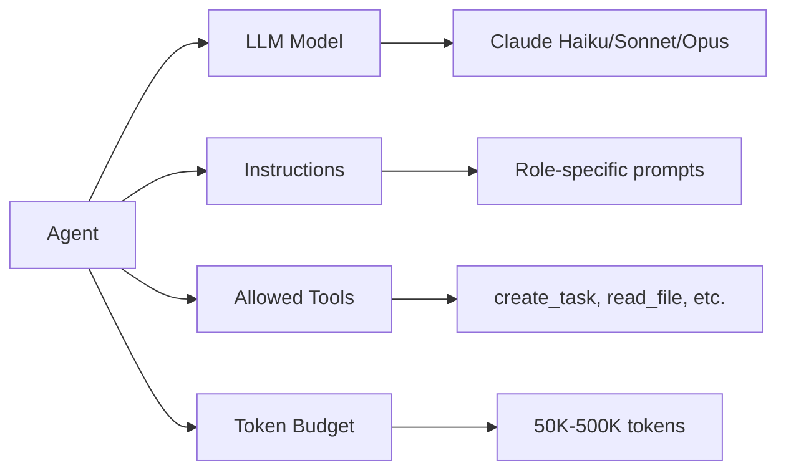
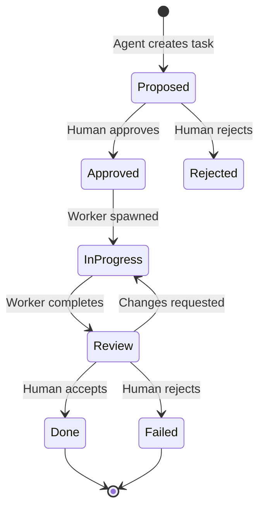

# Core Concepts

Cortana is built on six core concepts. Understanding these will help you use the system effectively.

## 1. Threads: The Unit of Conversation

A **thread** is a single conversation within a channel. Think of it like a Slack thread or a GitHub discussion.

### Thread Anatomy

```
┌─────────────────────────────────────────┐
│  Thread: "Build user authentication"    │
├─────────────────────────────────────────┤
│  User: "@ceo Let's build auth"          │
│  CEO: "I'll break this into tasks..."   │
│  CTO: "Reviewing the architecture..."   │
│  Worker: "Code complete, artifacts..."  │
└─────────────────────────────────────────┘
```

### Thread States

| State | Description |
|-------|-------------|
| **Active** | Currently being used, agents can respond |
| **Archived** | Inactive, moved to context memory |
| **Paused** | Temporarily disabled (e.g., waiting on human) |

### Thread Lifecycle

1. **Created** — User or agent starts a conversation
2. **Active** — Messages flow, agents respond, tasks are created
3. **Archived** — After inactivity (configurable, default 7 days), thread is archived and its knowledge is promoted to context-level memory

**Best practice:** One thread per feature or investigation. Don't mix unrelated topics in the same thread.

---

## 2. Channels: Where Your Team Lives

A **channel** is a persistent workspace that contains multiple threads and has a set of member agents.

### Channel vs. Thread

| Channel | Thread |
|---------|--------|
| Persistent workspace | Single conversation |
| Contains multiple threads | Lives inside a channel |
| Has member agents | Inherits channel's agents |
| Never archived | Auto-archived after inactivity |

### Channel Types

**By project:**
```
├── auth-system
├── landing-page
├── api-redesign
```

**By function:**
```
├── feature-development
├── bug-fixes
├── research
├── ops-alerts
```

**By team (for larger orgs):**
```
├── backend-team
├── frontend-team
├── devops
```

### Channel Settings

- **Members**: Which agents can participate
- **Webhooks**: External integrations (GitHub, Slack)
- **Notifications**: Email or in-app alerts for task approvals
- **Context scope**: Thread, channel, or org-level memory

---

## 3. Agents: Your AI Teammates

**Agents** are specialized AI assistants with defined roles, instructions, and tool permissions.

### Agent Types

#### Permanent Agents
Long-running agents that stay active in your channels:

| Agent | Role | Tools |
|-------|------|-------|
| @ceo | Strategy, task breakdown | create_task, read_board, search_memory |
| @cto | Architecture, technical decisions | read_board, search_memory, list_agents |
| @developer | Code implementation | read/write_file, bash, save_artifact |
| @reviewer | Code review, quality checks | read_file, grep, search_memory |

#### Worker Agents
Ephemeral agents spawned to execute specific approved tasks:

- Created automatically when a task is approved
- Have code execution capabilities (Docker-isolated)
- Terminated when task completes
- Save artifacts for human review

### Agent Capabilities



### Sticky Context Routing

When you message an agent, Cortana remembers that interaction. Subsequent messages without @mentions automatically route to the last agent who responded to you:

```
User: "@ceo What's our pricing strategy?"
CEO: "Based on market research, I recommend..."

User: "Can you elaborate on the freemium tier?"
→ Auto-routed to @ceo (no @mention needed)
```

This creates a natural conversation flow without constant @mentions.

---

## 4. Contexts: Cross-Thread Awareness

Cortana's memory system operates at three levels, ensuring agents never start from zero.

### Three-Level Memory Hierarchy

```
┌─────────────────────────────────────────┐
│           ORG LEVEL (Persistent)        │
│  Company-wide institutional knowledge   │
│  • Major decisions                      │
│  • Product strategy                     │
│  • Key learnings                        │
└─────────────────────────────────────────┘
                 ▲
                 │ Thread archived
        ┌────────┴─────────┐
        │                  │
┌─────────────────────────────────────────┐
│        CONTEXT LEVEL (Persistent)       │
│  Project-level knowledge                │
│  • Completed feature specs              │
│  • Architecture decisions               │
│  • Resolved bugs                        │
└─────────────────────────────────────────┘
                 ▲
                 │ Thread activity
        ┌────────┴─────────┐
        │                  │
┌─────────────────────────────────────────┐
│         THREAD LEVEL (Active)           │
│  Live conversation observations         │
│  • Current task progress                │
│  • Blockers and decisions               │
└─────────────────────────────────────────┘
```

### Observations

Agents compress conversation history into searchable **observations**:

```
[Obs] "Q1 2026: Pivot to B2B pricing after user feedback"
[Obs] "Auth system: JWT + refresh tokens, bcrypt hashing"
[Obs] "CEO created 3 tasks, CTO approved 2, worker completed 1"
```

### Cursors

Each agent has a **cursor** tracking where they left off:

```
@ceo:    cursor → message 45 (last action)
@cto:    cursor → message 52 (after approvals)
@worker: cursor → message 48 (task assigned)
```

This means agents resume exactly where they left off, not from message 0.

### Memory Promotion

When a thread is archived:
1. Thread-level observations are reviewed
2. Relevant knowledge is promoted to context-level
3. Org-level updates if major decisions were made

---

## 5. Tasks: How Work Gets Done

**Tasks** are the unit of work in Cortana. All agent-proposed work goes through a human approval gate.

### Task Lifecycle



### Task States

| State | Description | Next Action |
|-------|-------------|-------------|
| **PROPOSED** | Awaiting human approval | Approve or reject |
| **APPROVED** | Ready for execution | Worker spawns automatically |
| **IN_PROGRESS** | Being worked on | Wait for completion |
| **REVIEW** | Ready for human review | Accept or request changes |
| **DONE** | Completed successfully | Artifacts saved |
| **FAILED** | Worker encountered error | Review error, retry or close |

### Task Anatomy

```yaml
task:
  id: "task_12345"
  title: "Implement login endpoint"
  description: "Create POST /api/login with JWT token generation"
  status: "approved"
  assignee: "@worker"
  channel: "auth-system"
  thread: "thread_67890"
  depends_on: ["task_12344"]  # Database schema first
  artifacts:
    - name: "login_handler.ex"
      path: "/src/auth/login_handler.ex"
    - name: "test_report.md"
      path: "/tests/auth/login_test.md"
```

### Dependencies

Tasks can depend on other tasks. Workers wait for dependencies to complete before starting:

```
Task A: "Design database schema" → DEPENDENCY
Task B: "Implement login endpoint" → Depends on Task A
Task C: "Write tests" → Depends on Task B
```

---

## 6. MCP Tools: Extending Agent Capabilities

**MCP (Model Context Protocol)** allows Cortana to connect to external tools and services.

### What is MCP?

MCP is an open protocol for connecting AI systems to external tools. Cortana implements a full MCP client, enabling agents to:

- Call external APIs (GitHub, LinkedIn, Stripe)
- Use tools discovered from MCP servers
- Receive webhooks and post to channels

### Setting Up MCP

1. Go to **Admin → MCP Servers**
2. Click **"Add Server"**
3. Configure:
   - Server name (e.g., "GitHub")
   - Connection URL
   - Authentication (OAuth or API key)
4. Save and authorize

### Agent Tool Permissions

Not all agents can use all MCP tools. Permissions are configured per agent:

```yaml
agent: @developer
allowed_mcp_servers:
  - GitHub
  - Docker Hub
tools:
  - create_repo
  - create_pr
  - deploy_container

agent: @ceo
allowed_mcp_servers: []  # No MCP access
tools:
  - create_task
  - read_board
```

### Available MCP Integrations

| Integration | Tools Available |
|-------------|-----------------|
| **GitHub** | create_repo, create_pr, merge_pr, list_issues |
| **Slack** | post_message, create_channel, invite_users |
| **Stripe** | create_product, create_price, list_customers |
| **Custom** | Any Streamable HTTP MCP server |

### Rate Limiting

MCP calls are rate-limited to prevent abuse:

- **Per server**: 100 calls/hour
- **Per agent per server**: 30 calls/hour
- **Enforced via**: Hammer rate limiter

### Example: GitHub Integration

```
@developer: "Create a PR for the auth feature"
→ Discovers MCP server: GitHub
→ Calls tool: create_pr(
     repo: "lurielle-studio/cortana",
     branch: "feature/auth",
     base: "main",
     title: "Add user authentication"
   )
→ Posts PR link to channel
```

---

## Putting It All Together

Here's how the concepts work together in a real workflow:

```
1. User creates CHANNEL "auth-feature"
2. Adds AGENTS: @ceo, @cto, @developer
3. User posts in THREAD: "@ceo Build auth system"
4. @ceo creates TASKS (stored in memory via OBSERVATIONS)
5. Human approves tasks → Worker spawned
6. Worker uses MCP TOOLS to create GitHub PR
7. Worker saves code ARTIFACTS
8. Thread archived → Knowledge promoted to CONTEXT
9. Major decision promoted to ORG level
```

---

**Related:**
- [Quick Start Guide](/docs/quickstart) — Get started in 5 minutes
- [Agent Reference](/docs/agents) — Detailed agent capabilities
- [Workflows](/docs/workflows) — Common use case patterns
- [Architecture Overview](/docs/architecture) — Technical internals
